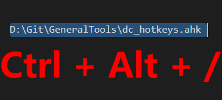
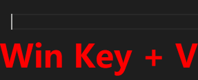
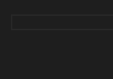

# GeneralTools
General tools that I use to make my everyday computing life a little easier. Windows only, sorry щ(ﾟДﾟщ)

## Setup
Either:
1. Download the latest .exe from [the releases page](https://github.com/Devination/GeneralTools/releases).
2. Double-click the .exe and it should show up in your taskbar.

OR

1. Download and install [AutoHotkey](https://www.autohotkey.com/).
2. Download the .ahk in this repo.
3. Double-click the .ahk and it should show up in your taskbar.

## Usage
Once the script is running in your toolbar, you'll have access to the following hotkeys. They will run in any program. Feel free to download the AHK to change or remove hotkeys you don't want.

### Cycle Slashes Inline
_Ctrl + Alt + /_

Cycles between \\\\, \\, and / in the current line of text.

### Paste File as Path
_Ctrl + Shift + V_

If you have a file copied in your clipboard, this will paste the file's path as text.

### Type Out Clipboard
_Win Key + V_

Pasting is lame, watch the characters be typed out in front of your eyes!

Example use cases:
* Paste without formatting.
* Paste passwords when the widget only allows typing.
* Select pasted file name in a Windows Explorer window.
* Impress your mom with your fast typing.

### Slash commands
Type "/shrug" plus another character (like space or enter) to get a fun emoticon.

| Command | Result          |
|---------|-----------------|
| /no     | ಠ_ಠ             |
| /shrug  | ¯\\_(ツ)_/¯      |
| /flip   | (╯°□°)╯︵ ┻━┻   |
| /flip2  | (┛◉Д◉)┛彡┻━┻    |
| /flip3  | (ノಠ益ಠ)ノ彡┻━┻ |
| /lenny  | ( ͡° ͜ʖ ͡°)        |
| /why    | щ(ﾟДﾟщ)         |
| /yay    | ヽ(＾∇＾)ﾉ      |

### TODO
* Configurable hotkeys via .ini file
